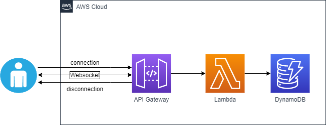
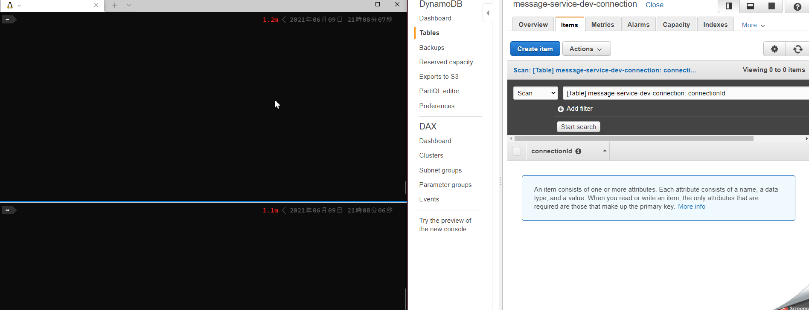

# API Gateway Websocket with Golang

## Architecture



## Build and Deploy

```
make deploy
```

## Verification

use [wscat](https://github.com/websockets/wscat)

```
wscat -c wss://<api-id>.execute-api.<region>.amazonaws.com/<stage>
```


